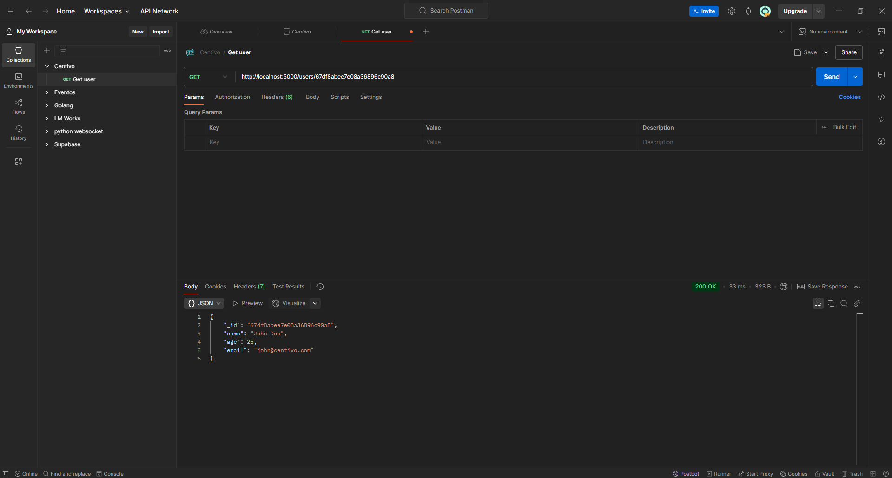

# Node.js API Challenge

## Overview
This project is a simple Node.js Express API that connects to MongoDB and retrieves user data based on an ID. It only returns users older than 21.

## How to Run
1. Clone the repository:
   ```sh
   git clone https://github.com/silkgod/Take-Home-Challenge-Centivo
2. Install dependencies:
   ```
   npm install
   ```
3. Start the server:
   ```
   npm start
   ```
## Result Example

